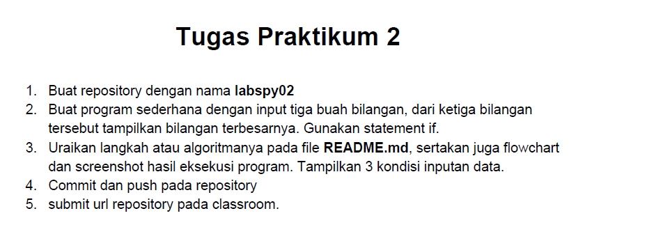
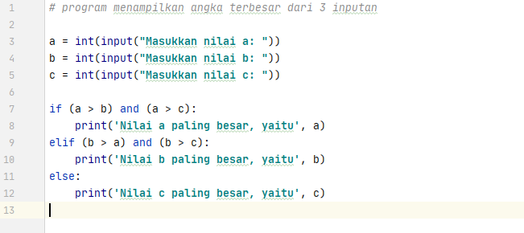
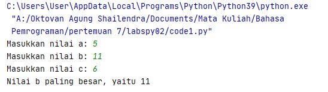
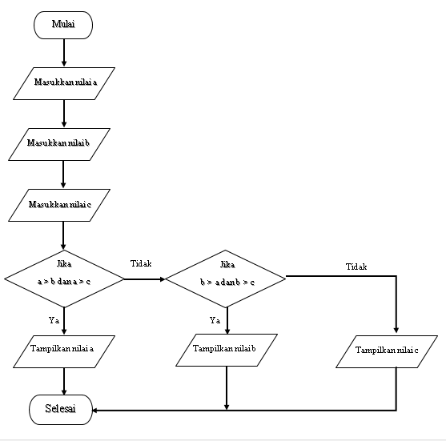

# TUGAS PRAKTIKUM 2

## SOAL



## JAWABAN

* Buka text editor seperti PyCharm, Visual Studio, Atom, dan lain-lain.
* Kemudian salin kode berikut ini.

``` python
# program menampilkan angka terbesar dari 3 inputan

a = int(input("Masukkan nilai a: "))
b = int(input("Masukkan nilai b: "))
c = int(input("Masukkan nilai c: "))

if (a > b) and (a > c):
    print('Nilai a paling besar, yaitu', a)
elif (b > a) and (b > c):
    print('Nilai b paling besar, yaitu', b)
else:
    print('Nilai c paling besar, yaitu', c)
```



* Simpan dengan nama `labspy02.py`, kemudian jalankan program tersebut. Maka akan menampilkan output seperti gambar di bawah ini :



* Flowchart dari program tersebut :



## PENJELASAN
  * Pada baris ke-3, menginstruksikan kita untuk memasukkan nilai **a**, kemudian akan disimpan dalam variabel `a` dalam bentuk integer.

  * Pada baris ke-4, menginstruksikan kita untuk memasukkan nilai **b**, kemudian akan disimpan dalam variabel `b` dalam bentuk integer.

  * Pada baris ke-5, menginstruksikan kita untuk memasukkan nilai **c**, kemudian akan disimpan dalam variabel `c` dalam bentuk integer.

  * Di baris ke-7, ada klausa `if` untuk pilihan kondisi pertama, dan `and` merupakan operasi logika, hasilnya adalah _True_ jika kedua operatornya bernilai benar. Misalnya

    * `a=4`,`b=10`,`c=5`, _"Jika nilai `a` lebih besar dari `b`"_ **(ini benar)**, dan _"Jika nilai `a` lebih besar dari `c`"_ **(ini benar)**. Maka program berlanjut ke baris-8, _cetak nilai `a` ke layar_.

